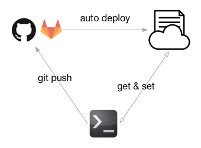

## summary

### eng
When `git push` to gitlab or github.  
git GUI will call webhook and auto deploy current version to Specified space.

### cht
目的為，當使用 git push 到 gitlab or github 後，自動透過 webhook 將目的端的 repo，自動將 master branch 進行更新。
方便當開發者要測試網站服務時的好幫手。

## Test ENV

- Linux DiskStation 3.10.77 #7321 SMP Wed Mar 23 11:47:12 CST 2016 x86_64 GNU/Linux synology_cedarview_713+
	- git 2.8
	- apache 2.2
	- php 5.6
- mac osx 10.11.4
	- git 2.6.4
	- apache 2.2
	- php 7.0

## Notice

### if use SSH to git pull / git fetch , required

- who use : `whoami` , may get apache or http
	- use it by php bash_exec.
- generate  ssh key : `sudo -u apache ssh-keygen -t rsa`
- known_hosts : sudo -u apache ssh <ssh host>
	- gitlab.com
	- github.com

### Go HTTPS 

You should type below after `git init`
```
git remote add origin https://<user>:<password>@gitlab.com/<repo>.git
```

## file

- generate.php : `generate.php?folder_name=your_project_name`
  - generate 'Token' and 'Webhook link'.
	  - Token : Take it set to config.php.
	  - Webhook link : Put it to 'git GUI service'
- config.php
  - setting token and deploy path.
- deploy.php : Will generate log and exec `git pull` to specified path.

- sample_demo/
  - follow this sample_demo/readme.md will help to know more about it.

## How to use

### Eng
0. First Notice!! **SSH** or **HTTPS**
1. `generate.php` will create 'token' and 'webhook link'
2. setting `config.php` with token.
3. Initial the repo folder. You can use `initial_deploy_repo.php` or manual init it.
	- `initial_deploy_repo.php?token=&repo_link=`
4. Setting 'webhook link' to 'git gui service' (gitlab/github)
5. Test the webhook

### Cht
0. 必須先注意用 **SSH** or **HTTPS** 進行 git 的動作行為
1. generate.php 產生 token 與 webhook link
2. 設定 config.php
3. 初始化 repo folder.
4. 設定 webhook 於 git GUI service (gitlab/github)
5. 測試 webhook

